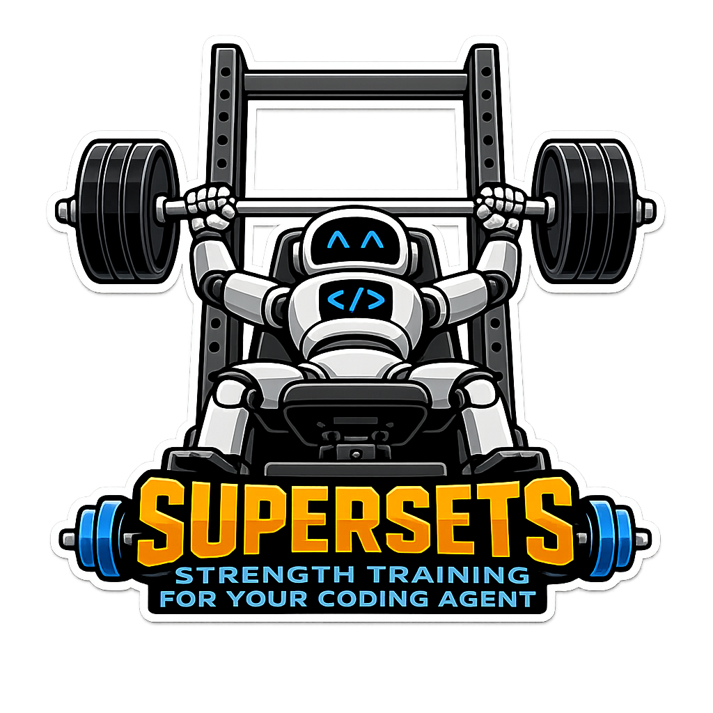

# Supersets

Battle-tested agent skills for strong software engineering.

<p align="center">
  <picture>
    <source media="(prefers-color-scheme: dark)" srcset="assets/supersets-logo-dark.png">
    <source media="(prefers-color-scheme: light)" srcset="assets/supersets-logo-light.png">
    
  </picture>
</p>

## Included skills

- [`writing-architecture-decision-records`](skills/writing-architecture-decision-records/SKILL.md) decides whether an architectural choice warrants an ADR, writes it, and preserves history when an accepted decision is superseded.
- [`writing-commits`](skills/writing-commits/SKILL.md) writes clear Git commit messages for future readers.

## Install

### Codex

```bash
codex plugin marketplace add dadliftcode/supersets
codex plugin add supersets@dadliftcode
```

### Claude Code

```bash
claude plugin marketplace add dadliftcode/supersets
claude plugin install supersets@dadliftcode
```

## Development

Supersets is a source-only plugin, so there is no build step. Validate the
source directly:

```bash
ruby -rjson -e 'ARGV.each { |file| JSON.parse(File.read(file)) }' \
  .codex-plugin/plugin.json \
  .claude-plugin/plugin.json \
  .agents/plugins/marketplace.json \
  .claude-plugin/marketplace.json

ruby -rjson -e 'versions = ARGV.map { |file| JSON.parse(File.read(file)).fetch("version") }; abort "version mismatch: #{versions.join(" != ")}" unless versions.uniq.one?' \
  .codex-plugin/plugin.json \
  .claude-plugin/plugin.json

claude plugin validate . --strict

python3 "${CODEX_HOME:-$HOME/.codex}/skills/.system/plugin-creator/scripts/validate_plugin.py" .
```

Before tagging a release, smoke-test the checkout through both real hosts:

1. Add this checkout as a local marketplace and install
   `supersets@dadliftcode` in Codex and Claude Code.
2. Start a fresh session in each host and confirm both included skills are
   discoverable.
3. In each host, exercise the commit-writing skill on staged changes. Exercise
   the ADR skill on a consequential choice, a choice that does not warrant an
   ADR, and an accepted ADR that must be superseded without erasing history.

## Releases

Supersets follows [Semantic Versioning](https://semver.org/). The release
version appears in both plugin manifests and must match; marketplace entries
do not duplicate it.

For each release, update both manifests in the same commit, run the validation
commands above, tag that commit as `vX.Y.Z`, and publish matching GitHub release
notes. The repository tree is the release artifact; do not generate or commit
a separate build.

## License

Supersets is available under the [MIT License](LICENSE).
